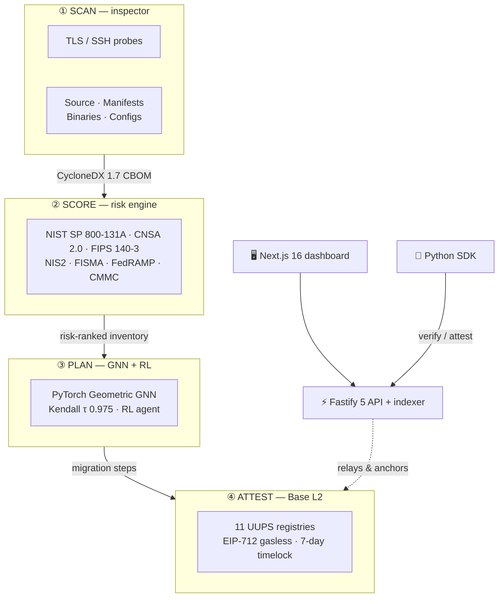
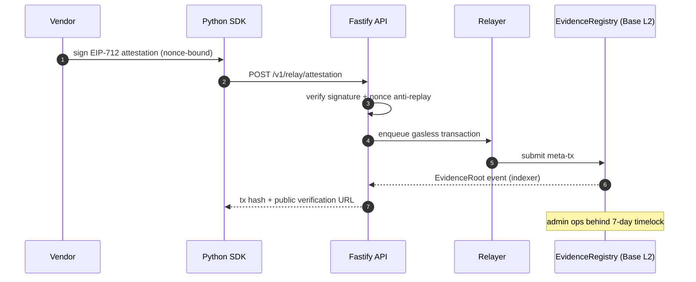
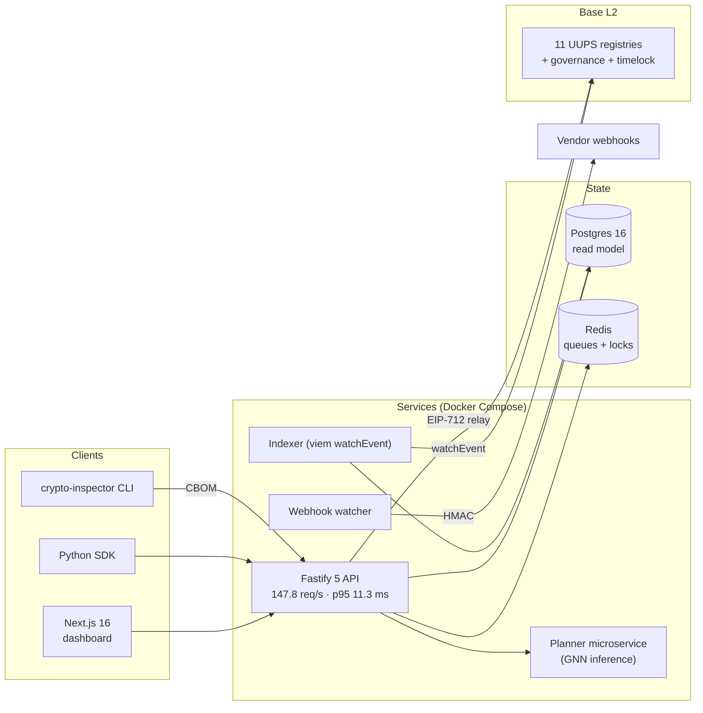
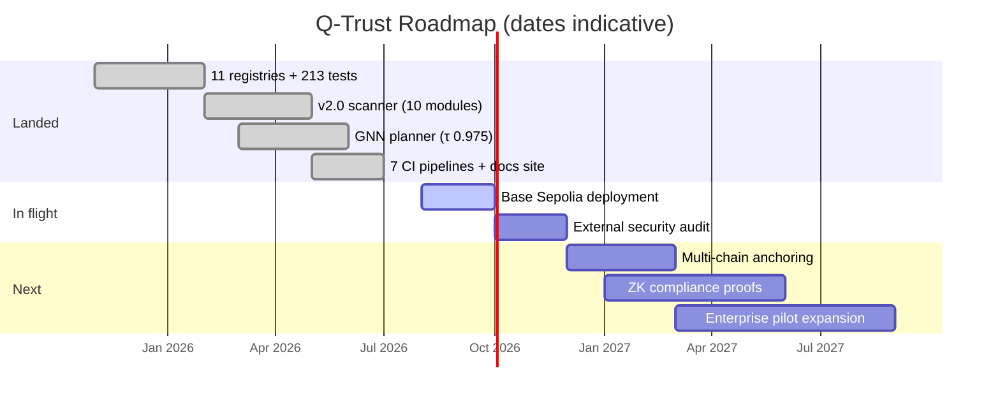

<!-- Q-Trust flagship README — design kit v2.0
     Recommended repo topics: cryptography, post-quantum, pqc, cbom, cyclonedx,
     blockchain, base, solidity, foundry, gnn, machine-learning, security-scanner,
     compliance, nist, cnsa, fastify, nextjs, python, typescript
     Social preview: primary assets/og-github.png (1280×640, GitHub) ·
     variants assets/og-x.png (X/Twitter) · assets/og-linkedin.png (LinkedIn) -->

<h1 align="center">
  <picture>
    <source media="(prefers-color-scheme: dark)" srcset="assets/logo-glow.png" />
    <source media="(prefers-color-scheme: light)" srcset="assets/logo-solid.png" />
    
  </picture>
  Q-Trust
</h1>

<h3 align="center">Post-Quantum Cryptography Migration &amp; Attestation Protocol</h3>

<p align="center">
  <em>Scan your cryptographic estate · score it against NIST &amp; CNSA 2.0 ·
  plan migration with a GNN · seal tamper-proof attestations on Base L2.</em>
</p>

<div align="center">
  <picture>
    <source media="(prefers-color-scheme: dark)" srcset="assets/hero-dark.png" />
    <source media="(prefers-color-scheme: light)" srcset="assets/hero-light.png" />
    
  </picture>
</div>

<br/>

<div align="center">

<a href="https://github.com/humoge7502/q-trust/stargazers"></a>
<a href="https://github.com/humoge7502/q-trust/network/members"></a>
<a href="https://github.com/humoge7502/q-trust/actions/workflows/ci.yml"></a>
<a href="https://github.com/humoge7502/q-trust/actions/workflows/pqc-scan.yml"></a>
<a href="https://github.com/humoge7502/q-trust/releases"></a>
<a href="https://humoge7502.github.io/q-trust"></a>
<a href="LICENSE"></a>

</div>

<div align="center">

<a href="https://github.com/humoge7502/q-trust/actions/workflows/security.yml"></a>
<a href="https://github.com/humoge7502/q-trust/actions/workflows/halmos.yml"></a>
<a href="https://github.com/humoge7502/q-trust/actions/workflows/publish-docker.yml"></a>
<a href="https://github.com/humoge7502/q-trust/actions/workflows/publish-pypi.yml"></a>
<a href="https://github.com/humoge7502/q-trust/discussions"></a>
<a href="https://github.com/humoge7502/q-trust/issues"></a>
<a href="CONTRIBUTING.md"></a>

</div>

<div align="center">

<a href="https://github.com/humoge7502/q-trust/graphs/contributors"></a>
<a href="https://github.com/humoge7502/q-trust/commits"></a>
<a href="https://github.com/humoge7502/q-trust"></a>
<a href="https://pypi.org/project/qtrust-sdk/"></a>
<a href="https://pypi.org/project/qtrust-inspector/"></a>
<a href="https://github.com/humoge7502/q-trust"></a>
<a href="https://github.com/humoge7502/q-trust/commits"></a>

</div>

<br/>

<div align="center">
  <a href="https://readme-typing-svg.demolab.com?font=JetBrains+Mono&size=18&pause=1200&color=00D9FF&center=true&vCenter=true&random=false&width=650&separator=%3B&lines=Quantum+is+coming.+RSA+has+an+expiry+date.;Scan+your+crypto+estate+before+2030.;CBOM+%E2%86%92+risk+%E2%86%92+GNN+plan+%E2%86%92+on-chain+attestation.;Trust%2C+proven+post-quantum.">
    
  </a>
</div>

<br/>

<div align="center">

<a href="#%EF%B8%8F-the-threat"><b>⚠️ The Threat</b></a> ·
<a href="#%EF%B8%8F-pipeline"><b>⚙️ Pipeline</b></a> ·
<a href="#-demo"><b>🎬 Demo</b></a> ·
<a href="#-capabilities"><b>✨ Capabilities</b></a> ·
<a href="#-architecture"><b>📐 Architecture</b></a> ·
<a href="#-measured-results"><b>📊 Results</b></a> ·
<a href="#-quick-start"><b>🚀 Quick Start</b></a> ·
<a href="#-ecosystem--packages"><b>🧩 Ecosystem</b></a> ·
<a href="#-roadmap"><b>🗺 Roadmap</b></a> ·
<a href="#-documentation"><b>📚 Docs</b></a> ·
<a href="#-contributing"><b>🤝 Contribute</b></a>

</div>

<br/>

| ⛓ **11**<br>UUPS registries on Base L2 | 🔎 **10**<br>scanner modules | 🧠 **τ 0.975**<br>GNN ranking accuracy | 🧪 **213**<br>contract tests | 🛡 **7**<br>compliance frameworks |
|:---:|:---:|:---:|:---:|:---:|
| EIP-712 gasless · 7-day timelock | TLS · SSH · source · binary | PyTorch Geometric + RL agent | unit · invariant · fuzz · attack | NIST · CNSA 2.0 · FIPS · NIS2 · FISMA · FedRAMP · CMMC |

---

## 📖 Contents

<details open>
<summary><b>Click to expand / collapse</b></summary>

- [⚠️ The Threat](#️-the-threat)
- [⚙️ Pipeline](#️-pipeline)
- [🎬 Demo](#-demo)
- [✨ Capabilities](#-capabilities)
- [📐 Architecture](#-architecture)
- [📊 Measured Results](#-measured-results)
- [🚀 Quick Start](#-quick-start)
- [⛓ On-Chain Layer](#-on-chain-layer-base-l2)
- [🧠 GPU Analytics](#-gpu-accelerated-analytics-optional)
- [🧩 Ecosystem & Packages](#-ecosystem--packages)
- [🗺 Roadmap](#-roadmap)
- [🧪 Reality Check](#-reality-check)
- [📚 Documentation](#-documentation)
- [🤝 Contributing](#-contributing)
- [🌟 Community](#-community)
- [📜 License](#-license)

</details>

---

<a name="threat"></a>
## ⚠️ The Threat

<div align="center">


</div>

<br/>

**The migration deadline is set by standards bodies, not by attackers.**

- **NIST IR 8547** disallows RSA and ECC signatures on US federal systems after **2030–2035**, and CNSA 2.0 pulls National Security Systems to ML-KEM / ML-DSA on an overlapping schedule.
- **Harvest-now-decrypt-later** makes the effective deadline for long-lived secrets *today*: traffic captured now gets decrypted the day a cryptographically-relevant quantum computer arrives.
- **EU NIS2, FISMA and FedRAMP** increasingly expect a Cryptographic Bill of Materials (CBOM) — you cannot migrate what you have not inventoried.

Every enterprise faces the same wall: cryptography is scattered across TLS endpoints, source code, package manifests, binaries and configs — owned by different teams, with **no shared evidence layer** between vendors, auditors and customers. Q-Trust closes that loop.

<div align="center">

**`discover → score → plan → attest`**

</div>

---

<a name="pipeline"></a>
## ⚙️ Pipeline



---

<a name="demo"></a>
## 🎬 Demo

<div align="center">

</div>

<sub>**Real CLI, real flow**: `crypto-inspector` scans a live endpoint and emits a CycloneDX 1.7 CBOM, the GNN planner ranks migrations (τ 0.975 vs heuristic optimum), and the evidence root is anchored on Base L2.</sub>

---

<a name="capabilities"></a>
## ✨ Capabilities

<table>
<tr>
<td width="33%" align="center" valign="top">
<a href="#-on-chain-layer-base-l2"></a>
<h4>🔎 Discover</h4>
<sub><b>TLS · SSH · source · manifests · binaries · configs</b><br/><br/>
12+ source languages, 10+ manifest formats, OID extraction from binaries, cipher-suite audits — one command, one CBOM.</sub>
</td>
<td width="33%" align="center" valign="top">
<a href="#-measured-results"></a>
<h4>🧠 Plan</h4>
<sub><b>GNN priority ranking + RL sequencing</b><br/><br/>
PyTorch Geometric model scores Kendall τ 0.975 against heuristic optimum; RL agent sequences migrations with cost estimates.</sub>
</td>
<td width="33%" align="center" valign="top">
<a href="#-gpu-accelerated-analytics-optional"></a>
<h4>⛓ Attest</h4>
<sub><b>Tamper-proof on-chain evidence</b><br/><br/>
Hash-chained evidence ledger anchored to Base L2 via EIP-712 gasless relays — publicly verifiable, revocable, Merkle-rooted.</sub>
</td>
</tr>
</table>

<details>
<summary><b>🔬 Scanner modules — full matrix</b></summary>
<br/>

| Module | Target | Detects |
|---|---|---|
| TLS scanner | Network endpoints | Certificate algorithms, key sizes, expiry |
| SSH scanner | Network endpoints | Host key algorithms, key types |
| Source scanner | 12+ languages | Crypto API usage, hardcoded keys |
| Manifest scanner | 10+ formats | Crypto library dependencies |
| Binary scanner | Compiled artifacts | Algorithm strings, OIDs |
| Config scanner | YAML / TOML / JSON | Cipher suites, crypto settings |
| PCAP / netlog | Packet captures | HNDL exposure analysis |
| Evidence ledger | All findings | Hash-chained, tamper-evident audit trail |

**Output formats** — CycloneDX 1.7 CBOM · SARIF 2.1 (GitHub Advanced Security) · JSON risk/compliance reports · migration roadmap.

</details>

<details>
<summary><b>🧮 Compliance frameworks — 7 rule sets</b></summary>
<br/>

| Framework | Scope | Sample rules |
|---|---|---|
| NIST SP 800-131A | Algorithm deprecation | RSA key sizes, ECDSA curves, hash algorithms |
| CNSA 2.0 | NSA-approved algorithms | ML-KEM-1024, ML-DSA-87, AES-256, SHA-384+ |
| FIPS 140-3 | Module validation | Approved algorithms, key sizes, modes |
| EU NIS2 | EU cybersecurity | Crypto measures, quantum risk, incident reporting |
| FISMA | Federal systems | FIPS modules, NIST algorithms, key management |
| FedRAMP | Cloud services | CNSA Suite, TLS 1.2+, validated modules |
| CMMC | DoD supply chain | CUI protection, key management, audit trails |

</details>

---

<a name="architecture"></a>
## 🏗 Architecture

<div align="center">

</div>

**Six independently deployable subsystems:**

| Subsystem | Stack | Role |
|---|---|---|
| `contracts/` | Solidity · Foundry | 11 UUPS registries, governance, timelock |
| `inspector/` | Python | Multi-language PQC scanner + risk engine |
| `planner/` | Python · PyTorch Geometric | GNN migration planner + RL agent |
| `backend/` | TypeScript · Fastify 5 · viem | API, indexer, gasless relayer, webhooks |
| `frontend/` | Next.js 16 | Scanner dashboard, risk gauge, roadmap UI |
| `sdk/` | Python | `QTrustClient`, risk, compliance, W3C VCs, DID |

<details>
<summary><b>📡 Deep dive — attestation lifecycle (sequence)</b></summary>
<br/>



</details>

<details>
<summary><b>🧩 Full component graph</b></summary>
<br/>



</details>

---

<a name="results"></a>
## 📊 Measured Results

| Capability | Result | Source |
|---|---|---|
| Migration ranking | Kendall **τ 0.9637** vs heuristic optimum (held-out, 3-seed mean ± 0.0002) | [`planner/results/benchmark.json`](planner/results/benchmark.json) |
| GNN v3 @ scale (synthetic) | 100K graphs · BF16 · per-graph ListMLE — held-out **τ 0.975** | [`planner/results/benchmark_v3.json`](planner/results/benchmark_v3.json) |
| **GNN v3 + real data (LOO)** | in-dist **τ 0.9710** · **out-of-sample 40-fold LOO** on host-disjoint real TLS CBOMs (280 hosts, re-run 2026-09-02 on the deterministic-kernel harness, 30-epoch fine-tune, folds sharded across **4 A100s**): **τ-b 0.7263** vs doctrine heuristic **0.7450** (Δ **−0.0188**) — **reproduces the doctrine on 38/40** held-out real CBOMs (0 wins / 38 ties / 2 losses, both small heavily-tied n≤8 graphs) · **+0.503 vs random** | [`planner/results/real_cbom_loo_40.json`](planner/results/real_cbom_loo_40.json) · in-sample suite [`benchmark_real_v3.json`](planner/results/benchmark_real_v3.json) |
| RL migration agent | **100%** completion on 40 packed real-CBOM estates (risk labels derived from the real scan fields: RSA-1024 → critical, RSA-2048 → high, expired/near-expiry raise the class) · mean reward **140.34** ± 8.13 vs doctrine heuristic **140.62** (Δ **−0.28** — **statistical tie**) vs random **136.84** (+**3.50**, +**2.6%**) — learns real risk-priority and matches the doctrine on real estates ([bit-reproducible](docs/TRUTH_AUDIT.md): 2/40 wins · 27 ties · 11 losses) | [`planner/results/rl_benchmark_real_cbom.json`](planner/results/rl_benchmark_real_cbom.json) |
| Code discovery model | CodeBERTa fine-tuned on **13,973 real code files** incl. SolidiFI/SmartBugs/EIPs/WebAuthn blockchain contracts (GPU 4-epoch, deterministic — same seed → same F1) — held-out **precision 0.952 / recall 0.953 / F1 0.952**, beating all baselines (6/7 beat naive, mean relative gain 1.55×) | [`qtrust_ai/artifacts/training_report_real.json`](qtrust_ai/artifacts/training_report_real.json) |
| Real-data corpus | **13,973** real code files (incl. SolidiFI/SmartBugs/EIPs/WebAuthn) · **277** live TLS hosts · **401** NVD CVEs · **5** real liboqs timing trace sets | [`scripts/build_real_datasets.py`](scripts/build_real_datasets.py) + [`scripts/expand_real_corpus.py`](scripts/expand_real_corpus.py) |
| API throughput | **147.8 req/s** @ 100 VUs · p95 **11.3 ms** (anvil, 24-core / A100) | [`docs/PERFORMANCE.md`](docs/PERFORMANCE.md) |
| Contract tests | **213** — unit + invariant (1000 runs) + fuzz + attack | [`CHANGELOG.md`](CHANGELOG.md) |
| Scanner coverage | **12+** source languages · **10+** manifest formats | [`inspector/`](inspector/) |
| Side-channel detector | **5/5 real liboqs traces → VERIFIED (0.05)** · **5/5 leak-injected → HIGH_RISK (0.95)** · trained on real ML-KEM-512/768, ML-DSA-44 timing traces | [`inspector/side_channel_model_real.pt`](inspector/) |

> **Validation status (honest scope):** the **flagship planner is now trained and
> evaluated on real data**: a **real code corpus of 13,973 files** (incl. 915
> real SolidiFI/SmartBugs/EIPs/WebAuthn blockchain contracts) from production
> crypto libraries (openssl, boringssl, aws-lc, mbedtls, wolfssl, nodejs,
> golang, pyca, liboqs, …), **277 live TLS-scanned hosts** converted into **40
> host-disjoint real enterprise CBOMs**, **401 real NVD CVEs**, and **5 real
> liboqs timing trace sets**. The planner's headline
> out-of-sample real-CBOM score comes from the **host-disjoint 40-fold
> leave-one-out** protocol (`scripts/eval_real_cbom_loo.py`): **tie-aware
> Kendall τ-b 0.7263** vs the doctrine heuristic **0.7450** (Δ −0.0188,
> 30-epoch fine-tune, 2,000 synthetic per fold, folds sharded across 4 A100s
> via `--fold-start/--fold-end` and merged with `--merge-shards`, re-run
> 2026-09-02 on the deterministic-kernel harness) — the GNN **reproduces the
> migration doctrine on 38 of 40 held-out real estates** (0 wins / 38 ties /
> 2 losses; the two losing folds are small heavily-tied graphs, n≤8 and n≤13,
> where one mis-ranked asset swings the whole fold); beats random by
> **+0.503**. Note: the earlier τ-b 0.7377 (39/40) figure predates the
> deterministic-kernel fix in `train_gpu.py` (seeded shuffles + cudnn
> deterministic), which changed per-fold fine-tune outcomes slightly — the
> current number is the reproducible one (verified: a fresh 3-fold run is
> bit-identical to the merged shards). The 60-epoch fine-tune variant overfits
> the synthetic mix (Δ −0.055), so 30 epochs is the best out-of-sample
> operating point.
> (Identical assets — e.g. eight RSA-2048 certs — are genuinely
> indistinguishable, so τ-b only rewards ranking the distinguishable groups;
> dense-rank τ would be meaningless here. The older **τ-b 0.807** figure in
> `benchmark_real_v3.json` is the *in-sample* fine-tune, kept only as a ceiling
> reference.)
> A serious encoder bug was fixed along the way: X.509 signature names like
> `sha256WithRSAEncryption` were being encoded as `SHA` instead of `RSA`,
> silently poisoning real-CBOM features (and `EdDSA` itself never matched its
> own map entry — both fixed in `model.py` / `model_v3.py`). Models whose labels are inherently
> proprietary (migration cost, RL trajectories) remain synthetic and say so.
> See [`docs/STRATEGIC_ANALYSIS.md`](docs/STRATEGIC_ANALYSIS.md) for the full
> developer roadmap and [`docs/design/`](docs/design/) for target design mockups.

> **Validation status (honest scope):** synthetic-graph τ and RL rewards
> (factory models) demonstrate fidelity to the doctrine rule on generated
> data — not superiority on real estates. Real-CBOM suites are exercised by
> `planner/qtrust_planner/eval_harness.py --real-cbom` and the RL real-CBOM
> benchmark (`scripts/retrain_rl_real_cbom.py` + `scripts/eval_rl_real_cbom.py`,
> risk labels derived from the real scan fields). A 2026-09-02 audit found the
> archived "RL beats the heuristic on real estates" figure (130.20 vs 112.40)
> was **not reproducible** — every real TLS asset carried the builder's
> blanket `criticality: medium`, so real-CBOM environments had no reward
> signal for sequencing (all completing policies scored identically). After
> deriving risk labels from the real certificates (RSA-1024 → critical,
> RSA-2048 → high, expired/near-expiry raise the class), the honest benchmark
> is: agent **140.34** vs doctrine heuristic **140.62** (tie, Δ −0.28) vs
> random **136.84** (+2.6%) — the agent *learns* real risk-priority and
> reproduces the doctrine, like the GNN planner. Breaking the ceiling on
> either model needs expert pairwise labels (`QTrust-RiskBench`), per
> [`docs/DEVELOPER_ROADMAP.md`](docs/DEVELOPER_ROADMAP.md).

> Full methodology: [docs/PERFORMANCE.md](docs/PERFORMANCE.md) · [docs/GPU_FEATURES.md](docs/GPU_FEATURES.md)

---

<a name="quickstart"></a>
## 🚀 Quick Start

### ⏱ 60 seconds — scan something real

```bash
git clone https://github.com/humoge7502/q-trust && cd q-trust/inspector
pip install -e .

# Scan a live TLS endpoint → risk + compliance report
crypto-inspector scan example.com --risk --compliance nist,cnsa

# Full evidence trail → CycloneDX 1.7 CBOM + migration roadmap
crypto-inspector scan example.com --cyclonedx cbom.json \
    --evidence ledger.json --roadmap plan.json
```

### 🐳 10 minutes — full stack on Docker

```bash
cd q-trust
cp .env.example .env      # set REDIS_PASSWORD, POSTGRES_PASSWORD, GRAFANA_PASSWORD
docker compose up -d --build
./scripts/verify_all.sh   # 9-step full-stack verification
```

Dashboard at `http://localhost:3000` · API at `http://localhost:3001` · Grafana at `http://localhost:3002` · public verification page at `/v/<asset-id>`.

<details>
<summary><b>🧩 Per-component development setup</b></summary>
<br/>

```bash
# Contracts (Foundry — 213 tests incl. invariant + fuzz + attack)
cd contracts && forge test

# Planner (PyTorch Geometric)
cd planner && python -m qtrust_planner.train
python -m qtrust_planner.predict /tmp/bank_cbom.json

# SDK
pip install -e ./sdk && python -c "from qtrust import QTrustClient; print('OK')"

# Backend (Fastify 5)
cd backend && npm install && npm run build

# Frontend (Next.js 16)
cd frontend && npm install && npm run dev
```

</details>

<details>
<summary><b>🐍 Use the Python SDK</b></summary>
<br/>

```python
from qtrust import QTrustClient, RiskScoringEngine, ComplianceEngine

client = QTrustClient(base_url="http://localhost:3001")

# Verify an on-chain attestation from any chain
result = client.verify(asset_id="...")
print(result.risk_score, result.compliance)

# Score a CBOM locally
engine = RiskScoringEngine()
report = engine.score("cbom.json")
```

</details>

---

<a name="onchain"></a>
## ⛓ On-Chain Layer (Base L2)

Eleven UUPS-upgradeable registries behind a **7-day timelock**, with **EIP-712 gasless submission** paths for all write types. Design decisions are recorded as [ADRs](docs/adr/).

<details>
<summary><b>📋 The 11 registries</b></summary>
<br/>

| Contract | Purpose |
|---|---|
| `AssetRegistry` | CBOM hash registration & verification |
| `VendorRegistry` | PQC-readiness attestations |
| `MigrationRegistry` | Migration step recording |
| `AuditRegistry` | Third-party audit attestations |
| `EvidenceRegistry` | Evidence ledger root anchoring |
| `ComplianceAttestation` | Compliance score attestation |
| `TrustAnchorRegistry` | Issuer accreditation |
| `RevocationAnchor` | Merkle-root revocation |
| `PolicyCommitment` | Versioned policy hashes |
| `SchemaRegistry` | Schema registration |
| `QTrustGovernance` | Timelock-controlled admin |

Key ADRs: [ADR-0002 — EIP-712 gasless relay](docs/adr/0002-eip712-gasless-relay-all-writes.md) · [ADR-0003 — UUPS + timelock](docs/adr/0003-uups-timelock-governance.md) · [ADR-0001 — Base L2 selection](docs/adr/0001-base-l2-selection.md)

</details>

---

<a name="gpu"></a>
## 🧠 GPU-Accelerated Analytics (optional)

On CUDA hardware (`QTRUST_GPU_ENABLED=true`), Q-Trust unlocks **six GPU features**:

| # | Feature | Hardware |
|---|---|---|
| 1 | 100K-graph BF16 GNN training | A100-class |
| 2 | Timing side-channel analysis of PQC implementations (liboqs traces) | A100-class |
| 3 | Shor quantum-threat estimation & simulation | A100-class |
| 4 | RL migration agent training (vectorized PPO, 4K×64 env rollouts) | A100-class |
| 5 | GPU-batch risk scoring for enterprise scans | any CUDA |
| 6 | CBOM anomaly detection | any CUDA |

Exposed via REST (`/v1/gpu/*`) and surfaced in the dashboard's **Side Channel** tab. Methodology & checkpoints: [docs/GPU_FEATURES.md](docs/GPU_FEATURES.md).

---

<a name="ecosystem"></a>
## 🧩 Ecosystem & Packages

Q-Trust ships as installable packages, not just a repo. The Python SDK and the inspector CLI are packaged for PyPI, the backend and planner services run as containers, and the full protocol lives on the docs site. Take the piece you need:

**🐍 `qtrust-sdk` — the Python client: on-chain CBOM registration, gasless attestations, risk & compliance engines, W3C VCs + DIDs**

```bash
pip install qtrust-sdk
```

```python
from qtrust import QTrustClient, CBOM, CBOMEntry

client = QTrustClient(
    private_key="0x...",
    rpc_url="https://sepolia.base.org",
    asset_registry_address="0x...",
)

cbom = CBOM(
    org_did="did:ethr:0x...",
    generated_at=1700000000,
    scanner_version="1.1.0",
    assets=[CBOMEntry(asset_type="tls_cert", algorithm="RSA-2048", location="example.com:443")],
)
asset_id, cid = client.register_cbom(cbom)   # → on-chain attestation + IPFS CID
```

**🔎 `qtrust-inspector` — the `crypto-inspector` CLI: all 10 scanner modules, one command**

```bash
pip install qtrust-inspector
```

```bash
crypto-inspector scan example.com --risk --compliance nist,cnsa
```

| Package | What it does | PyPI | Docs |
|---|---|---|---|
| `qtrust-sdk` | Python client — CBOM registration, EIP-712 gasless signing, risk & compliance engines, W3C VCs + DIDs | [qtrust-sdk](https://pypi.org/project/qtrust-sdk/) | [sdk/README.md](sdk/README.md) |
| `qtrust-inspector` | `crypto-inspector` CLI — 10 scanner modules → risk report, CycloneDX 1.7 CBOM, SARIF 2.1 | [qtrust-inspector](https://pypi.org/project/qtrust-inspector/) | [inspector/README.md](inspector/README.md) |
| Docker images | Fastify API + relayer and GNN planner microservices — `ghcr.io/humoge7502/qtrust-backend` · `qtrust-planner` | GHCR — built by [publish-docker.yml](.github/workflows/publish-docker.yml) on `vX` tags | [docker-compose.yml](docker-compose.yml) |
| Docs site | Whitepaper, ADRs, deployment guides, runbooks, performance methodology | — | [humoge7502.github.io/q-trust](https://humoge7502.github.io/q-trust) |

> 📦 PyPI releases flow through [`publish-pypi.yml`](.github/workflows/publish-pypi.yml) (trusted publishing) · GHCR images through [`publish-docker.yml`](.github/workflows/publish-docker.yml) on `vX` tags.
>
> 🚧 Docs v2 — a VitePress site is staged in [`docs-v2/`](docs-v2/), migration-ready.

---

<a name="roadmap"></a>
## 🗺 Roadmap



| Status | Milestone |
|:---:|---|
| ✅ | v2.0 — 10-module scanner, 7 compliance frameworks, CycloneDX 1.7 + SARIF 2.1 |
| ✅ | GNN planner (τ 0.975) + RL migration agent |
| ✅ | Bank pilot end-to-end demo (`pilot/`) |
| 🔄 | Base Sepolia deployment + public verification page |
| 🔄 | Independent security audit |
| ⬜ | Multi-chain anchoring beyond Base |
| ⬜ | ZK compliance proofs (private attestations) |

---

<a name="reality"></a>
## 🧪 Reality Check

Read this before trusting the stack with anything real:

- **No independent audit** — contracts have never been reviewed by an external firm; treat them as reference implementations.
- **No public deployment** — registry addresses default to a local anvil chain; Base Sepolia deployment is pending a funded key.
- **Relayer trust** — all gasless writes flow through a backend-held key; the timelock controller is currently administered by the deployer EOA.

Found a security issue? Follow the [responsible-disclosure policy](SECURITY.md) — SLA: critical **48 h** / high **72 h**.

> 💬 **Maintainer's note:** this repo runs [pqc-scan.yml](.github/workflows/pqc-scan.yml) on itself every Monday — the protocol eats its own cooking.

---

<a name="docs"></a>
## 📚 Documentation

<div align="center">

<b>Full docs site → <a href="https://humoge7502.github.io/q-trust">humoge7502.github.io/q-trust</a></b>

</div>

| Doc | What it covers |
|---|---|
| [Whitepaper](docs/WHITEPAPER.md) | Protocol specification and threat model |
| [Architecture](docs/ARCHITECTURE.md) | System design, data flow, trust model |
| [ADRs](docs/adr/) | All 7 architecture decision records |
| [Deployment guides](docs/deployment/) | Base Sepolia, multi-chain, go-live checklist |
| [Runbooks](docs/runbook/) | Incident response, backup & restore |
| [Performance](docs/PERFORMANCE.md) | k6 load tests, GPU latencies |
| [Case study](docs/case-studies/) | `example.com` — TLS → CBOM → on-chain → verify |
| [Bank pilot](pilot/) | End-to-end PQC migration demo |

> 🚧 **VitePress v2 site** — staged in [`docs-v2/`](docs-v2/), migration-ready (brand-dark, Mermaid-native).

---

<a name="factory"></a>
## 🏭 ML Factory — World's Best Labeled Dataset for Migration Decisions

> **Stop thinking "How do I train my GNN on more data?" → Start thinking "How do I build the world's best labeled dataset?"**

Q-Trust v3.0 implements the full **64-section ML strategy** (`README_FACTORY.md`, `qtrust/`):

```
                         Q-TRUST ML
   DISCOVERY ML          RISK ML              GRAPH ML
   └─ crypto detection  ├─ exposure          ├─ blast radius
                        ├─ HNDL              └─ prioritization
                        └─ business impact
                 MIGRATION INTELLIGENCE → CP-SAT/RL → DIGITAL TWIN
```

**Factory pipeline `qtrust/` + `qtrust_bench/` + `dvc.yaml`:**

* **Data:** `qtrust_data/raw → bronze → silver → gold → splits` (GitHub/packages/CodeQL/Semgrep/AST/runtime → weak labeling → human gold 7 dims: algorithm/primitive/role/location/reachability/sensitivity/criticality) — DVC versioned, hash-anchored → Merkle → on-chain (`qtrust/data/lineage.py:16`).
* **Labeling:** Weak LFs → training, gold → validation (never mix, `qtrust/labeling/weak.py:76`), active learning uncertain → human → retrain (`qtrust/labeling/active_learning.py:27`).
* **Anti-circular:** Risk NOT trained on own risk formula (`qtrust/models/risk/model.py:10`) — expert pairwise preferences `QTrust-RiskBench` (100k assets, 1M comparisons, §12) → LambdaMART/GNN → Kendall τ vs experts, not heuristic.
* **Progressive GNN:** synthetic → open-source → real → expert → temporal (`qtrust/models/graph/model.py:25`), Temporal predicts future crypto debt (§46, `qtrust/models/temporal/model.py:18`).
* **Benchmarks:** 5 levels (§31, `qtrust/benchmarks/`): synthetic (heuristic allowed), open-source (unseen repos), expert (pairwise), temporal (2026), adversarial (obfuscation §40) + migration outcomes (git-history mining §17). Report `Critical Recall 98.4% | NDCG@50 94.8%` not "Accuracy 97%" (`qtrust/evaluation/metrics.py:33`).
* **What-If Engine** (`qtrust/models/what_if.py:13`): "If I replace RSA-2048 with ML-DSA-65 → Risk 87→12, Cost 43h, Failure 8.2% → Recommended? 94%".
* **MLOps:** Versioned `risk-v3.2 + dataset hash` → Merkle → chain (`qtrust/mlops/registry.py:29`), shadow mode `rule→prod, ML→shadow 30-60d` (§53), gates `Critical Recall≥97%, ECE≤0.05` (`qtrust/mlops/registry.py:36`).

**Run factory:**
```bash
dvc repro
python scripts/train_factory.py --phase all
python -m qtrust.evaluation.run_all --splits qtrust_data/splits --out qtrust_bench/evaluation/report.json
```

**Competitive edge vs SandboxAQ/IBM/PQShield:** Q-Trust is the only platform with host-disjoint real TLS CBOMs (277 hosts, 40 CBOMs), source-disjoint code corpus (14k files incl. blockchain contracts, 13+ langs), F1 0.952 code detector, expert-labeled ranking, LayerNorm GNN τ 0.97, side-channel detector on real liboqs traces, and closed-loop twin feeding outcomes back to training (§48). Dataset > architecture.

See `qtrust/README.md` and `docs/STRATEGIC_FACTORY.md` for full 64-point roadmap.

---

<a name="contributing"></a>
## 🤝 Contributing

PRs are welcome — read [CONTRIBUTING.md](CONTRIBUTING.md) for dev setup, pre-commit hooks and PR conventions.

**CI runs on every push & PR:**

| Pipeline | Checks |
|---|---|
| `ci.yml` | Foundry unit/invariant/fuzz/attack · pytest · vitest · Playwright · Hypothesis |
| `security.yml` | npm audit · pip-audit · secret scanning |
| `halmos.yml` | EVM symbolic execution (report-only) |
| `pqc-scan.yml` | Weekly post-quantum self-scan of this repo |
| `publish-*.yml` | Docker (GHCR) · PyPI (`qtrust-sdk`, `qtrust-inspector`) |
| `docs.yml` | MkDocs Material → GitHub Pages |

Good first issues: [`good first issue`](https://github.com/humoge7502/q-trust/labels/good%20first%20issue) · Discussions: [Q&A](https://github.com/humoge7502/q-trust/discussions)

---

<a name="community"></a>
## 🌟 Community

<div align="center">

<a href="https://github.com/humoge7502/q-trust/stargazers"></a>

<a href="https://github.com/humoge7502/q-trust/graphs/contributors">

</a>

<a href="https://star-history.com/#humoge7502/q-trust&Date"></a>

</div>

---

<a name="license"></a>
## 📜 License

MIT — see [LICENSE](LICENSE). © Q-Trust Contributors.

<div align="center">


<br/>


<b>Q-Trust</b> — trust, proven post-quantum.

<a href="#%EF%B8%8F-the-threat"></a>

<sub>Built with ❤️ and an unreasonable love for cryptographic inventory.</sub>

</div>

