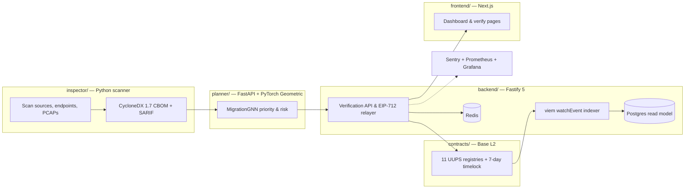

# System Overview

Q-Trust is a post-quantum migration assurance platform: it inventories your
cryptographic estate, scores it, plans the migration, and anchors the whole
process on Base L2 so third parties can verify it. The monorepo is organized
into six subsystems, each independently built and tested.

## Dataflow

Everything starts with a scan: the inspector's probes (TLS handshakes, AST
analysis of source trees, binary/manifest sweeps, PCAP analysis) emit
`AssetFinding` objects that flow through the risk engine and compliance
scoring into a CycloneDX 1.7 CBOM. The SDK pins the CBOM to IPFS and
registers its SHA-256 hash on-chain; the backend relays gasless EIP-712
submissions, indexes every registry event into Postgres for fast reads, and
serves the frontend. The planner reads the same CBOM, builds a dependency
graph, and returns a priority-ordered migration plan (GNN model, with a
rule-based fallback when no trained checkpoint is present).

## Subsystems

| Subsystem | Responsibility | Key tech |
| --- | --- | --- |
| `contracts/` | 11 registries — Vendor, Asset, Schema, Evidence, Audit, Migration, TrustAnchor, RevocationAnchor, ComplianceAttestation, PolicyCommitment, Governance — under UUPS proxies | Solidity 0.8.24, OpenZeppelin UUPS + AccessControl, 7-day `TimelockController` (ADR-0003), Foundry |
| `inspector/` | Crypto discovery, risk scoring, compliance evaluation, HNDL exposure analysis | Python, Typer CLI (`crypto-inspector`), `cryptography`, CycloneDX 1.7, SARIF 2.1 |
| `planner/` | Migration priority & feasibility from CBOM graphs | FastAPI, PyTorch Geometric GCN (`MigrationGNN`), RL agent, rule-based fallback |
| `backend/` | Verification API, gasless relayer, event indexer, webhooks | Fastify 5, viem `watchEvent`, Postgres, Redis, Sentry, Prometheus |
| `sdk/` | Python client for the whole protocol | Web3.py, Pydantic models (`CBOM`, `AssetRecord`, …), multi-provider IPFS pinning, W3C VC/DID |
| `frontend/` | Org dashboard, vendor explorer, public asset verification | Next.js, React 19, Tailwind CSS, wagmi/RainbowKit |

## Design decisions

The most important trade-offs are recorded as ADRs in the repo
(`docs/adr/`): Base L2 for sub-cent EVM writes (ADR-0001), EIP-712 gasless
relay for **all** writes so submitters never pay gas (ADR-0002), UUPS behind
a 7-day timelock with the deployer renouncing admin after handover
(ADR-0003), a Postgres read model with RPC fallback (ADR-0004), and
deterministic content-addressed IDs so identical CBOMs hash identically
(ADR-0006).

::: warning Honest limits
The GNN planner is a research model: on the v3 held-out benchmark it reaches
Kendall τ ≈ 0.975 against a rule-based upper bound (which scores 1.0 by
construction). It ranks migration priority; it does not certify correctness
of any migration.
:::
