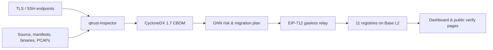

---
# https://vitepress.dev/reference/default-theme-home-page
layout: home

hero:
  name: Q-Trust
  text: Post-Quantum Migration & Attestation
  tagline: |
    Scan TLS endpoints, source trees and binaries into CycloneDX 1.7 CBOMs,
    then plan, attest and verify migrations on Base L2.
    10-module inspector · GNN planner (Kendall τ 0.975) · 11 UUPS registries ·
    research pre-release.
  image:
    src: /hero.png
    alt: Q-Trust
  actions:
    - theme: brand
      text: Get Started
      link: /guide/getting-started
    - theme: alt
      text: View on GitHub
      link: https://github.com/humoge7502/q-trust

features:
  - icon: 🔍
    title: CBOM Scanner
    details: >
      10 scanner modules across TLS endpoints, source code, AST, binaries,
      package manifests and PCAPs — emitting CycloneDX 1.7 CBOMs and SARIF 2.1
      findings.
    link: /packages/inspector
  - icon: 🧠
    title: GNN Planner
    details: >
      PyTorch Geometric migration planner scoring per-asset priority, with
      Kendall τ 0.975 against a rule-based upper bound on the held-out
      benchmark split.
    link: /architecture/overview
  - icon: ⛓️
    title: On-Chain Attestation
    details: >
      11 UUPS-upgradeable registries on Base L2 — CBOMs, vendor attestations,
      migrations, audits — behind a 7-day timelock governor.
    link: /architecture/overview
  - icon: ⚡
    title: Gasless Relay
    details: >
      EIP-712 typed-data signatures with per-signer nonces and replay
      protection, submitted by a Fastify 5 relayer.
    link: /security/overview
  - icon: 🐍
    title: Python SDK
    details: >
      qtrust-sdk on PyPI — register CBOMs, pin evidence to IPFS, score trust
      deterministically, issue W3C Verifiable Credentials.
    link: /packages/sdk
  - icon: 🛡️
    title: Compliance Scoring
    details: >
      7 frameworks scored out of the box — NIST SP 800-131A, CNSA 2.0,
      FIPS 140-3, EU NIS2, FISMA, FedRAMP, CMMC.
    link: /packages/inspector
---

## How it fits together

Q-Trust connects discovery to provable action: the inspector turns your
cryptographic estate into a machine-readable CBOM, the GNN planner ranks what
to migrate first, and the on-chain registries make the result verifiable by
anyone — without gas for the submitter.

Scans produce evidence, plans order the work, and every registration lands on
Base L2 with a content-addressed hash — so a verifier can always re-derive the
answer from the CBOM. The whole path is designed to be reproducible: same
scan, same CBOM hash, same on-chain record.

::: tip Status — research / pre-release
Q-Trust is a solo-maintained research project. All numbers on this site are
measured in-repo (see [CHANGELOG](https://github.com/humoge7502/q-trust/blob/main/CHANGELOG.md)
and `docs/PERFORMANCE.md`), but the protocol is **not production ready**.
:::
