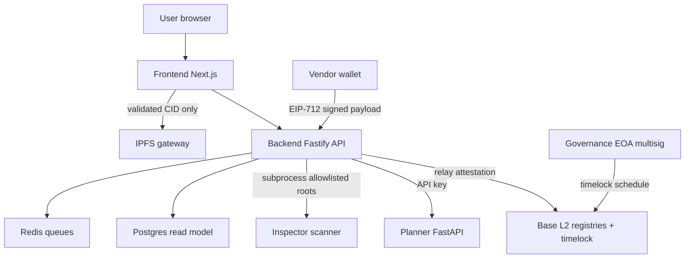

# q-trust Security Threat Model

Repo-grounded threat model produced with the `security-threat-model` skill (2026-09-06).
Every architectural claim carries an evidence anchor. Produced during an autonomous
engineering run: user context questions were not answerable interactively, so all
assumptions are stated explicitly in §Scope and assumptions.

## Executive summary

Q-Trust is a post-quantum-cryptography (PQC) migration coordinator whose most valuable
assets are the **integrity of on-chain evidence** (registries attesting crypto-asset
inventories, audits, and migration claims) and the **relayer private key** that pays
for gasless EIP-712 attestations. Highest-risk themes, in order:

1. **On-chain integrity via the permissionless write path.** Registration is EOA-signature
   (EIP-712) + backend relayer; a compromised relayer or weak signature-domain binding
   forges registry state. Mitigated by timelock governance, role gates, daily relayer
   spend cap, and per-vendor nonces — residual risk concentrates in relayer key custody.
2. **Server-side fetch of attacker-influenceable URLs.** The public verification page
   fetched `metadata_uri` (set on-chain by the registrar) server-side with only a prefix
   strip — an SSRF vector. **Fixed during this threat-model pass** with strict CID
   validation (`frontend/src/lib/api.ts`, TM-FE-01).
3. **Scanner processes hostile source code and archives.** The inspector parses untrusted
   projects; mitigations are path-root allowlists (`QTRUST_SCAN_ALLOWED_ROOTS`, verified
   fail-closed) and pure-Python parsing (no eval), but parser DoS remains a medium risk.

No secrets are committed (secret sweep + CI gitleaks clean). ML checkpoints are loaded
with `weights_only=True` (`planner/qtrust_planner/predict.py:78`), closing the
pickle-deserialization class.

## Scope and assumptions

**In scope:** `backend/` (Fastify API + relayer), `contracts/` (Solidity registries),
`planner/` (FastAPI inference service), `inspector/` (scanner CLI), `frontend/`
(Next.js app), `sdk/` (Python client). **Out of scope:** `qtrust_ai/` training-only
tooling, `docs-v2/` site build, notebooks, CI runner security.

**Assumptions (explicit, since this was produced autonomously):**
- Deployment is the shipped `docker-compose.yml` single-host model, backend not directly
  internet-exposed (compose binds `127.0.0.1:3001`); a reverse proxy with TLS terminates
  public traffic. If the backend is exposed directly, several Medium risks rise to High.
- The relayer key is a hot key with a small balance and daily cap, not a treasury.
- CBOM payloads are operator-supplied (semi-trusted), not fully public-untrusted.
- Single org-per-tenant model; no cross-tenant sharing of the Postgres read model.

**Open questions that would change rankings:**
1. Is the backend directly internet-exposed in any deployment? (If yes: TM-BE-02, TM-BE-03 escalate.)
2. Who can acquire the `REGISTRAR_ROLE` on mainnet? (If permissionless: TM-CT-01 escalates.)
3. Is multi-tenancy planned for the Postgres read model? (If yes: row-level isolation becomes P0.)

## System model

### Primary components
- **Frontend** `frontend/` — Next.js 16 app; public verification pages (`/v/[id]`), vendor portal, scanner UI. Server components fetch from the backend API.
- **Backend API** `backend/src/server.ts` — Fastify; REST routes (`routes/*.ts`), relayer (`services/attestation.ts`), Postgres read model + RPC fallback (ADR 0004), webhook fan-out.
- **Contracts** `contracts/src/` — 11 UUPS registries behind `QTrustGovernance` timelock; EIP-712 attestation flows with per-vendor nonces.
- **Planner** `planner/server.py` — FastAPI; GNN/RL inference; API-key auth, rate limiter, CBOM asset cap.
- **Inspector** `inspector/` — CLI scanning untrusted codebases (regex + AST + network/TLS probes); invoked server-side through the backend scanner route.
- **SDK** `sdk/qtrust/` — Python client for registries and verification.

### Data flows and trust boundaries
- **Internet → Frontend (edge):** static/SSR pages; TLS assumed at proxy; no secrets.
- **Frontend server → Backend API:** JSON over HTTP; API key for protected routes (`backend/src/server.ts`); response schema from `lib/generated/api-schema.ts`.
- **Browser → Backend:** public read endpoints; rate limiting and CORS allowlist (`QTRUST_CORS_ORIGINS`, fail-closed — verified crash on missing value).
- **Vendor EOA → Relayer → Contracts:** EIP-712 signed attestation payloads; relayer validates nonce + signature before `relayAttestation` (`backend/src/services/attestation.ts`); daily spend cap (`QTRUST_RELAYER_DAILY_SPEND_CAP_ETH`).
- **Backend → Planner:** server-to-server with `X-Api-Key` (`planner/server.py` middleware, fail-closed in production); payload capped (`QTRUST_PLANNER_MAX_ASSETS`); 4xx→422 / 5xx→503 mapping in `backend/src/routes/read.ts`.
- **Backend → untrusted code (scanner):** `run_inspector.py` subprocess with allowlisted roots (`QTRUST_SCAN_ALLOWED_ROOTS`, startup-refusal verified); path-traversal guard returns 400 (verified).
- **Backend/Frontend → IPFS gateway:** fetch of attacker-influenceable CIDs — hardened this pass (`isValidIpfsCid`, redirect: "error").
- **Planner → model files:** local checkpoint load, `weights_only=True`.

#### Diagram

## Assets and security objectives

| Asset | Why it matters | Objective |
|---|---|---|
| Registry contract state (assets, audits, accreditations) | The product *is* verifiable evidence; forged rows destroy trust | Integrity (C/I/A) |
| Relayer private key | Signs broadcasts; theft allows forged (but nonce-bound) attestations and gas drain | Confidentiality + Integrity |
| Governance EOA(s)/multisig | Controls upgrades and pauses via timelock | Integrity |
| CBOM contents (hosts, algorithms, certs) | Sensitive infra disclosure if exposed | Confidentiality |
| Planner checkpoints | Model provenance and availability; poisoned model corrupts rankings | Integrity + Availability |
| Postgres/Redis | Read-model integrity and availability | I/A |
| API keys (`QTRUST_PLANNER_API_KEY`, backend keys) | Prevent unauthorized planner scans/writes | Confidentiality |

## Attacker model

### Capabilities
- Public internet user: read public endpoints, submit registration/attestation payloads through documented flows, register assets on-chain (if permissionless), control their own on-chain strings (`metadata_uri`, DID strings).
- On-chain attacker: deploy contracts, register assets with hostile CBOM hashes/metadata URIs, observe all public chain state.
- Vendor-role insider (if role granted): produce signed EIP-712 attestations for their own nonce sequence.
- Supply-chain attacker: malicious dependency or model checkpoint reaching a build/load path (defended: `weights_only`, lockfiles, audits in CI).

### Non-capabilities
- Not assumed: direct host access, database credentials, governance-key compromise, TLS-breaking, or the ability to reach internal-only services from outside the deployment network.

## Entry points and attack surfaces

| Surface | How reached | Trust boundary | Notes | Evidence |
|---|---|---|---|---|
| `POST /v1/relay/attestation` | Backend REST | Internet → relayer | Signature + nonce validation before broadcast | `backend/src/services/attestation.ts`, `frontend/src/lib/api.ts:235` |
| `POST /plan`, `/plan/deadline`, `/rl/plan` | Backend→planner | S2S + API key | Schema validation + asset cap + 422 mapping | `planner/server.py:564,652,788`, `backend/src/routes/read.ts` |
| `POST /scan` (backend scanner route) | Backend | Auth + root allowlist | Subprocess; traversal guard 400 (verified live) | `backend/src/routes/scanner.ts`, `backend/scripts/run_inspector.py` |
| `/v/[id]` IPFS fetch | Frontend server component | On-chain string → server fetch | CID validation + `redirect: "error"` (this pass) | `frontend/src/lib/api.ts:299`, `frontend/src/app/v/[id]/page.tsx:47` |
| Registry upgrade/pause | Governance | Timelock + roles | `IPausable` compile-time invariant (PR #54) | `contracts/src/QTrustGovernance.sol`, `contracts/test/PausabilityInvariant.t.sol` |
| Planner checkpoint load | Local files | File → model | `weights_only=True` | `planner/qtrust_planner/predict.py:78` |
| Webhook subscriptions | Backend | Address-based; SSRF-checked public HTTPS | Verified live in adversarial pass | `backend/src/routes/webhooks.ts` |

## Top abuse paths

1. **Forged attestation via relayer compromise.** Goal: fake PQC-readiness. Steps: steal relayer key → replay/forge EIP-712 payload → broadcast. Impact: forged registry rows. Controls that bite back: per-vendor nonces (replay blocked), spend cap limits blast radius, timelock not bypassable. Residual: forged-but-valid signatures until key rotation.
2. **SSRF via `metadata_uri` → internal service read.** Steps: register asset with `metadata_uri = http://planner:8000/…` or cloud-metadata URL → public `/v/[id]` server fetch → response rendered on the page. **Fixed this pass** (CID validation); pre-fix this was a genuine Medium/High on exposed deployments.
3. **Planner cost amplification.** Steps: giant CBOM → oversized response. Controls: asset cap + rate limiter (both verified live).
4. **Scanner escape via path traversal.** Steps: `POST /scan` with `../` roots → read arbitrary host files. Verified: 400 on traversal; startup refuses without allowlist.
5. **Malicious checkpoint substitution.** Steps: swap `model_real_v3.pt` → arbitrary pickle. Blocked: `weights_only=True`; image-baked checkpoints; rollback documented via `QTRUST_MODEL_PATH`.
6. **Governance bypass on upgrades.** Steps: direct `upgradeTo` call on a registry. Blocked: UUPS `_authorizeUpgrade` requires `DEFAULT_ADMIN_ROLE`; timelock delay enforced.
7. **Webhook SSRF.** Steps: subscribe internal URL → exfil. Blocked: address-based subscriptions + public-HTTPS validation (verified).
8. **Vendor nonce griefing.** Steps: drain vendor nonce via relayed requests. Impact: temporary DoS of a vendor's attestation flow; recoverable via on-chain nonce bump.

## Threat model table

| ID | Source | Prerequisites | Threat action | Impact | Assets | Existing controls (evidence) | Gaps | Recommended mitigations | Detection ideas | Likelihood | Impact | Priority |
|---|---|---|---|---|---|---|---|---|---|---|---|---|
| TM-CT-01 | On-chain attacker | Permissionless registrar role | Register hostile CBOMs / metadata to poison evidence | Misleading public evidence | Registry state | Registrar role gating (`AssetRegistry.sol`), validation suite | Role grant policy on mainnet undocumented | Document + gate `REGISTRAR_ROLE` grants; consider allowlist period | Index registration events; alert on volume anomalies | Medium | Medium | Medium |
| TM-CT-02 | Key thief | Relayer key compromise | Forged attestations, gas drain | Forged rows; relayer outage | Registry state, relayer key | Nonce binding (`attestation.ts`), daily cap (`QTRUST_RELAYER_DAILY_SPEND_CAP_ETH`), min-balance alert | No automatic key rotation | Rotate-on-schedule + on-alert; move to dedicated funding address | On-chain monitor: attestation rate per vendor | Low | High | Medium |
| TM-BE-01 | Malicious vendor | Vendor role | Oversized/hostile attestation payloads | Backend resource exhaustion | Availability | Fastify `bodyLimit` (`backend/src/server.ts`); schema validation | None noted | Keep payload caps under review | p95 latency alert on relay route | Low | Low | Low |
| TM-BE-02 | Internet attacker | Backend exposed directly (assumption: not) | Abuse relay/plans endpoints at volume | Cost + noise | Relayer budget, planner | API-key routes; CORS fail-closed; rate limiting | Public read endpoints are open by design | If exposed: edge rate limiting at proxy | 4xx/5xx dashboards | Low | Medium | Medium |
| TM-BE-03 | Internet attacker | Backend exposed directly | Probe scanner route with hostile archives | Parser DoS; potential parser bugs | Availability | Root allowlist + traversal 400 + subprocess isolation | Regex/AST parser DoS on pathological inputs | Cap scan size/time; run scanner with resource limits (ulimit/cgroups) | Scan-duration metrics | Medium | Medium | Medium |
| TM-PL-01 | Malicious insider (S2S) | Valid planner API key | Feed adversarial CBOMs to skew rankings | Corrupt migration priorities | Planner output | Input schema + validation gate (PR #51) + cap | Ranking robustness unquantified | Adversarial-input eval suite for ranking stability | Track plan churn per asset | Low | Medium | Low |
| TM-PL-02 | Supply chain | Write access to artifacts | Poison checkpoint | Corrupt rankings / RCE-pickle | Planner integrity | `weights_only=True` (`predict.py:78`); CI builds images from lockfiles | Checkpoint hashes not pinned at deploy | Pin SHA256 of checkpoints at deploy (files exist in repo) | Verify hash at startup, fail-closed | Low | High | Medium |
| TM-FE-01 | On-chain attacker | Asset registered | SSRF via `metadata_uri` server-side fetch | Internal service read | Frontend server trust | **FIXED**: `isValidIpfsCid` + `redirect:"error"` (`api.ts`), 8 regression tests | Gateway itself could be hostile (config) | Pin gateway + allowlist via env; consider CSP `connect-src` | — | — | — | Closed |
| TM-FE-02 | Vendor | Vendor-controlled `evidence_uri` | XSS via rendered link | Session theft (browser) | Users | `sanitizeUri` allowlist (FE-3 fix, `sanitize-uri.ts`); zero `dangerouslySetInnerHTML` | — | — | — | — | — | Closed |
| TM-OPS-01 | Config error | Operator misconfiguration | Start with permissive defaults | Varies | All | Fail-closed startup gates verified live (CORS/relayer/scan roots) | None noted | — | Startup-refusal is itself the alarm | Low | Medium | Low |

## Criticality calibration

- **Critical:** pre-auth RCE or signature forgery without key theft; governance bypass; cross-tenant registry corruption. (None identified.)
- **High:** relayer key theft with forged-but-valid attestations; scanner parser RCE; planner checkpoint poisoning reaching production.
- **Medium:** SSRF (pre-fix state of TM-FE-01), resource-exhaustion DoS of relay/planner/scanner, misleading evidence via hostile-but-valid registrations.
- **Low:** nonce griefing, log noise, single-tenant read-model exposures, transient CI failures.

## Focus paths for security review

| Path | Why it matters | Threat IDs |
|---|---|---|
| `backend/src/services/attestation.ts` | Signature/nonce validation before broadcast | TM-CT-01, TM-CT-02 |
| `backend/src/routes/scanner.ts` + `backend/scripts/run_inspector.py` | Subprocess boundary over hostile input | TM-BE-03 |
| `planner/qtrust_planner/predict.py` | Checkpoint load + inference input validation | TM-PL-01, TM-PL-02 |
| `frontend/src/lib/api.ts` (`fetchIpfsJson`, relay call) | Server-side fetch + browser-origin writes | TM-FE-01, TM-BE-02 |
| `contracts/src/QTrustGovernance.sol` | Upgrade/pause authority | TM-CT-02 |
| `backend/src/server.ts` (middleware chain) | CORS, rate limit, auth wiring | TM-BE-02 |

## Notes on use

Produced autonomously; §Scope and assumptions lists the three questions whose answers
would re-rank priorities. The two findings actionable without that context (TM-FE-01,
TM-PL-02 hardening) were implemented during this pass: TM-FE-01 fixed with tests;
TM-PL-02 recommendation (checkpoint SHA pinning at deploy) is recorded for the release
checklist. Update this document after any architecture change or when the three open
questions are answered.
