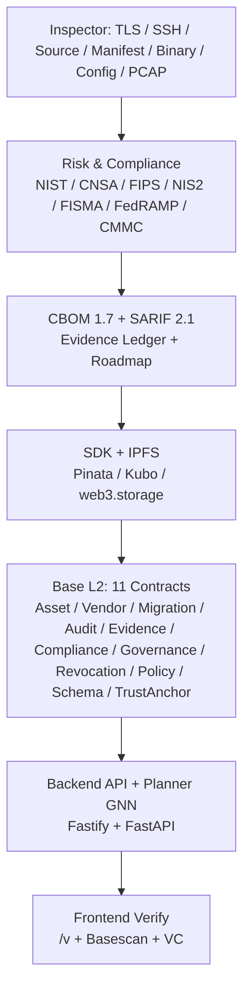
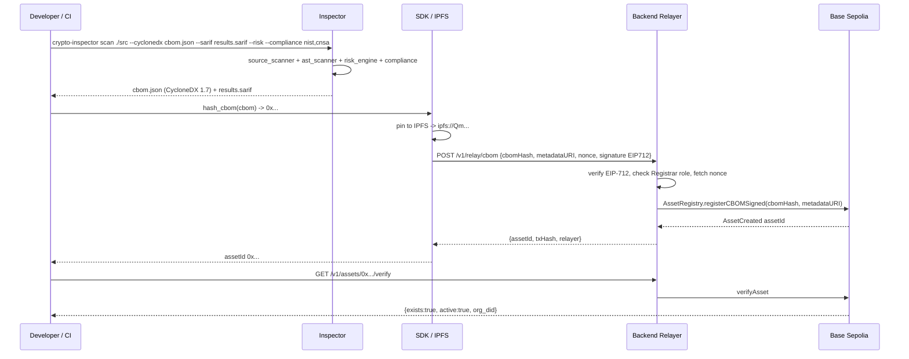

---
hide:
  - navigation
  - toc
---

# Q-Trust — Enterprise PQC Migration Protocol

<div class="grid cards" markdown>

- :material-shield-lock: **On-chain coordination for the post-quantum migration**

    ---

    Scan → Risk → Compliance → Plan → Attest → Verify on **Base L2**. CBOM 1.7, SARIF 2.1, GNN/RL planning, EIP-712 gasless relay, W3C Verifiable Credentials — audited, 211 Foundry tests, τ 0.975.

    :material-rocket-launch: [Quickstart](#quickstart){ .md-button .md-button--primary }
    :material-api: [API Reference](api.md){ .md-button }
    :material-file-document: [Whitepaper](WHITEPAPER.md){ .md-button }

</div>

### Trusted by the stack

[](https://github.com/humoge7502/q-trust/actions/workflows/ci.yml) [](https://sepolia.basescan.org/) [](https://humoge7502.github.io/q-trust) [](https://pypi.org/project/qtrust-sdk/) [](https://github.com/humoge7502/q-trust/blob/main/LICENSE) [](https://sepolia.base.org)

---

## Where to go next — routing by intent

| I want to… | Go to | What you get |
|---|---|---|
| Scan code or a TLS endpoint | [Guides: Scan your first CBOM](guides/scan-first-cbom.md) | 60-second CLI → CycloneDX 1.7 + SARIF |
| Deploy contracts to testnet | [Guides: Deploy to Base Sepolia](guides/deploy-base-sepolia.md) | Forge deploy + Basescan verify + compose up |
| Use the SDK in CI | [Guides: Integrate the SDK](guides/integrate-sdk.md) | hash_cbom → IPFS → EIP-712 gasless relay |
| Run the full stack locally | [Guides: Operate the stack](guides/operate-stack.md) | Docker compose + Prometheus/Grafana + runbooks |
| Understand the protocol | [Whitepaper](WHITEPAPER.md) | Threat model, GNN planner, on-chain design |
| See measured performance | [Performance](PERFORMANCE.md) + [_data/metrics.json](_data/metrics.json) | k6 147.8 rps, τ 0.975, GPU latencies |
| Evaluate for production | [Architecture](ARCHITECTURE.md) + [Reality check in README](../README.md#reality-check) | Honest limits: no audit, no public deploy, relayer trust |
| Developer's roadmap + critical analysis | [Strategic Analysis](STRATEGIC_ANALYSIS.md) | How to take Q-Trust further: audit-first, trust decentralization, real-data moat |
| Nine specialist sub-audits | [Specialist Audit](SPECIALIST_AUDIT.md) | Per-category reviews: contracts · backend · frontend · ML · SDK · DevOps · compliance · data · competitive |
| Design vision (images) | [docs/design/](https://github.com/humoge7502/q-trust/tree/main/docs/design) | Target architecture · Control Center · verification portal · PQC Passport · competitive positioning · roadmap |
| Verify an attestation | `GET /v/{assetId}` or `GET /v1/assets/{id}/verify` | On-chain existence, active, org_did |

*Last verified: 2026-08-29 · verifier: ./scripts/verify_all.sh*

---

## Quick links

<div class="grid cards" markdown>

- :material-sitemap: **Architecture**

    ---

    Five-layer design: contracts · indexer · backend · SDK · frontend. Mermaid dependency graph.

    [:octicons-arrow-right-24: Architecture](ARCHITECTURE.md)

- :material-file-document-outline: **Whitepaper**

    ---

    Protocol thesis, threat model, GNN planner, and on-chain attestation design.

    [:octicons-arrow-right-24: Whitepaper](WHITEPAPER.md)

- :material-api: **API Reference**

    ---

    OpenAPI 3.0.3 (`backend/openapi.yaml`), auth, pagination, 32 paths + scan/GPU extras. Swagger at `/docs`.

    [:octicons-arrow-right-24: API](api.md)

- :material-certificate: **CBOM Conformance**

    ---

    `qtrust.cbom.v1` → CycloneDX 1.7 mapping, extensions, gaps, and test harness.

    [:octicons-arrow-right-24: CBOM Conformance](CBOM_CONFORMANCE.md)

- :material-memory: **GPU Features**

    ---

    Six A100-accelerated features — GNN v3, side-channel CNN, quantum simulation, RL agent, parallel scanning, VAE anomaly detection.

    [:octicons-arrow-right-24: GPU Features](GPU_FEATURES.md)

- :material-speedometer: **Performance**

    ---

    k6 stress: 147.8 req/s @100 VUs, p95 11.3 ms. GPU latencies, reproducibility steps.

    [:octicons-arrow-right-24: Performance](PERFORMANCE.md)

- :material-rocket: **Deployment**

    ---

    Base Sepolia end-to-end, multi-chain, go-live checklist, verification via Basescan.

    [:octicons-arrow-right-24: Base Sepolia](deployment/BASE_SEPOLIA.md) · [Multi-Chain](deployment/MULTI_CHAIN.md) · [Go-Live](deployment/GO_LIVE_CHECKLIST.md)

- :material-briefcase: **Case Study: example.com**

    ---

    Scan → CBOM → on-chain → verify on local chain-id-84532 — validated end-to-end.

    [:octicons-arrow-right-24: Case Study](case-studies/CASE_STUDY_EXAMPLE_COM.md)

- :material-decision: **ADRs**

    ---

    Base L2, EIP-712 relay, UUPS+timelock, Postgres read model, VC/DID, content-addressed IDs.

    [:octicons-arrow-right-24: ADR 0000](adr/0000-record-architecture-decisions.md)

- :material-shield-check: **Operations**

    ---

    Backup & restore, incident response, SEV1 pause playbooks, indexer replay.

    [:octicons-arrow-right-24: Backup & Restore](runbook/backup-restore.md) · [Incident Response](runbook/incident-response.md)

- :material-hand-heart: **Contributing**

    ---

    Fork → branch → test → lint. Code style for Solidity / Python / TS, and PR process.

    [:octicons-arrow-right-24: Contributing](CONTRIBUTING.md)

- :material-security: **Security**

    ---

    Supported versions, reporting via GitHub Advisories / `humoge7502.security@gmail.com`, SLAs, controls.

    [:octicons-arrow-right-24: Security](SECURITY.md)

- :material-history: **Changelog**

    ---

    Keep-a-Changelog, SemVer. Audit remediations, benchmark fixes, and release notes.

    [:octicons-arrow-right-24: Changelog](CHANGELOG.md)

</div>

---

## Architecture preview

Five layers — from scanner probes to Base L2 anchoring — communicating through well-defined interfaces (`ScanResult` → CBOM → IPFS → `AssetRegistry` → planner → `MigrationRegistry` → `AuditRegistry`).





Full detail: [Architecture](ARCHITECTURE.md) · [Whitepaper §2–§7](WHITEPAPER.md) · [CBOM Conformance](CBOM_CONFORMANCE.md)

---

## Repository layout

```
contracts/   Foundry workspace — 11 Solidity contracts (UUPS, EIP-712, timelock)
inspector/   Python scanner producing CBOMs / SARIF / compliance reports
planner/     FastAPI microservice — GNN + RL migration planning (τ 0.975)
backend/     Fastify API — verification, attestation, relay, GPU bridge (32 OpenAPI paths)
sdk/         qtrust Python SDK for on-chain registration (web3.py 7.x)
frontend/    Next.js 16 dApp — wallet (wagmi+RainbowKit), dashboard, scanner, GPU panels
ops/         Prometheus, Grafana, AlertManager, k6 load tests
docs/        MkDocs Material site — whitepaper, ADRs, runbooks, API reference
```

---

## Quickstart <a id="quickstart"></a>

=== "Docker Compose (full stack)"

    ```bash
    cp .env.example .env   # fill RPC, private key, POSTGRES_PASSWORD, REDIS_PASSWORD
    docker compose up -d --build
    # API http://127.0.0.1:3001  Swagger http://127.0.0.1:3001/docs  Frontend http://127.0.0.1:3000
    # Planner http://127.0.0.1:8000  Prometheus http://127.0.0.1:9090  Grafana http://127.0.0.1:3002
    docker compose logs -f api
    ```

    `docker-compose.yml:14-38` binds Postgres/Redis to `127.0.0.1` only; healthchecks gate startup. See [Base Sepolia deployment](deployment/BASE_SEPOLIA.md).

=== "Per-component"

    ```bash
    # Contracts — 211 tests (invariant runs=1000, depth=100, fail_on_revert=true)
    cd contracts && forge test -vvv           # forge coverage --report lcov --ir-minimum

    # Inspector
    pip install -e ./inspector[dev] && pytest inspector/tests/

    # SDK
    pip install -e ./sdk[dev] && pytest sdk/tests/ -v --cov=qtrust --hypothesis-profile ci

    # Backend
    cd backend && npm ci && npm run typecheck && npm run build && npm test

    # Frontend
    cd frontend && npm ci && npm run build   # NEXT_PUBLIC_QTRUST_API_URL=http://localhost:3001 npm start

    # Planner
    cd planner && pip install torch --index-url https://download.pytorch.org/whl/cpu -r requirements.txt
    python -m qtrust_planner.benchmark --seeds 42 43 44   # writes planner/results/benchmark.json
    python -m qtrust_planner.train && python -m qtrust_planner.predict /tmp/bank_cbom.json
    ```

=== "CLI scan"

    ```bash
    crypto-inspector scan /path/to/project --cyclonedx cbom.json --sarif results.sarif --risk --compliance nist,cnsa --evidence ledger.json --roadmap plan.json
    crypto-inspector scan example.com --cyclonedx host_cbom.json --evidence ledger.json --roadmap plan.json
    crypto-inspector host example.com --ports 443,8443 --risk --compliance nist,cnsa,fips --cyclonedx out.json --sarif out.sarif
    ```

See [GPU Features](GPU_FEATURES.md) to put the A100 to work (`make -f Makefile.gpu help`).

---

## Security & trust

Threat model, SLAs, and controls live in [Security](SECURITY.md) — reports via [GitHub Security Advisories](https://github.com/humoge7502/q-trust/security/advisories/new) or `humoge7502.security@gmail.com`. Contracts are `UUPS` + 2-day `TimelockController`, EIP-712 domain-separated nonces, `whenNotPaused` on all writes, and SSRF DNS pinning. Audited: `docs/Q-Trust_Codebase_Audit.pdf` — all Critical/High fixed with regressions in `contracts/test/AuditRemediations.t.sol`.

---

## Next steps

* **Read the whitepaper** for the full protocol thesis ([Whitepaper](WHITEPAPER.md)).
* **Try the API** live at `http://localhost:3001/docs` — see [API Reference](api.md) for curl examples.
* **Explore the CBOM mapping** if you integrate with existing SBOM tooling ([CBOM Conformance](CBOM_CONFORMANCE.md)).
* **Deploy to Base Sepolia** following the [go-live checklist](deployment/GO_LIVE_CHECKLIST.md).
* **Contribute** — see [Contributing](CONTRIBUTING.md) and the [Changelog](CHANGELOG.md) for what landed in v2.1.
